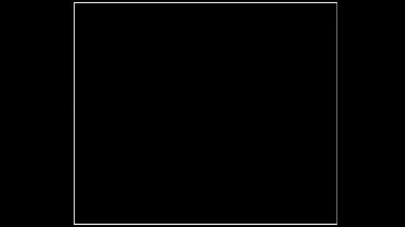

# All my most notable CS projects since I started programming in 2016

🎒 Scholar projects

👨‍💻 Personal projects

## Table of contents 

1. [2021-2022 | 2nd year of MIAGE master program](#M2MIAGE)
2. [2020-2021 | 1st year of MIAGE master program](#M1MIAGE)
3. [2019-2020 | 3rd year of MIAGE bachelor program](#L3MIAGE)
4. [2018-2019 | 2nd year of technical CS/IT program - IUT Informatique](#IUT2)
5. [2017-2018 | 1st year of technical CS/IT program - IUT Informatique](#IUT1)
6. [2016-2017 | A Level with a minor in CS](#ALEVEL)

## [1. 2021-2022 | 2nd year of MIAGE master program](#content-table) 

### More to come ... (M.I.A.G.E, placesearcher, ....)

### 🎒 [RoguelikeGenerator](https://github.com/Vanane/RoguelikeGenerator)

    
    
    
    

We had to find an idea for a plugin oriented architecture project. We developed a game were other developers can add their own plugin and improve the standard Roguelike gameplay we created. Other developers can add their own GUI, tiles, creatures, ...

## [2. 2020-2021 | 1st year of MIAGE master program](#content-table) 

### 🎒 [TinyPet](https://github.com/s-rigaud/frontend_cloud)

    
    
    

    
    
    
    

    

We had to create a scalable website and backend architecture using full potential of Google GCP. The app was a website where you can sign various petitions.

### 🎒 [LEGO Lejos ColorSorter](https://github.com/s-rigaud/leJOS_ColorSorter)

    
    

    

Given the hardware to assemble the LEGO Ev3 Mindstorm robot, we had to build the structure, to code a java program to execute instructions and a mobile app to send them. The goal was to send instructions on the mobile via Wifi or Bluetooth, the robot will follow them and move physically its components to sort color bricks.

### 🎒 [OpenData](https://github.com/s-rigaud/OpenData)

    
    
    
    

Creating many interactive maps to visualize medium housing prices of various French regions. The project was exploiting open data provided by French government.

### 🎒 Stock Manager 101

    
    

Building a C application with a central stock server and clients regularly updating their stocks on the platform. Built using TCP sockets.

### 👨‍💻 TF2_Table

    
    
    
    

Team Fortress 2 game trading table created to automate exchange and make profit by gathering informations of many websites.

### 👨‍💻 Square Game (Dot & Boxes)

    
    
    
    
    
    

Dot & Boxes game implementation for two players. You can play the game in a two different browsers and the actions are transmitted using socket.io messages.

## [3. 2019-2020 | 3rd year of MIAGE bachelor program](#content-table) 

### 🎒 e-commerce platform

    

The goal was to provide a terminal friendly interface to manipulate a e-commerce stock system. Designing and optimizing file access to find the optimum file accesses and readings. Setting indexes to improve queries with specific metrics.

### 🎒 [BlablaMIAGE](https://github.com/s-rigaud/blablamiage/tree/master/public/js)

    
    

    

Replica of the French carpooling website [blablacar.com](https://www.blablacar.com/). The project contains authentification features as wee as car reservation, trip planing and most convenient and shortest trip algorithm.

### 👨‍💻 [Rolit](https://github.com/s-rigaud/Rolit)

    
    
    

I created a two player Rolit board game. You can also play with an AI implementing the minimax algorithm with different depth  strategy perception.

### 👨‍💻 [Movie manager](https://github.com/s-rigaud/movie-manager)

    
    

    
    
    
    
    

I built a management website when you can manage movies and ratings.

## [4. 2018-2019 | 2nd year of technical CS/IT program - IUT Informatique](#content-table) 

### 🎒 CDA / LOTR theme movie website

    
    

The project's goal was to create an LOTR inspired website displaying quizzes about the movies with a fun user experience. The project was driven by the agile/ SCRUM methodology.

### 🎒 South Park slurs

    
    
    
    
    
    

Using a corpus of the millions of sentences from South Park. The project aims to show which words are more related to each character or other words. The relation between was calculated based over who said the word if other characters are in the sentence. With a bit of AI and graph plotting, it was then possible to see which characters was associated to which word.

### 🎒 Ephemeris

    
    

Generating a UI with multiple windows, rules and functionalities. Also prototyping several Data Access Objects like row based, column based or table based accesses.

### 🎒 Improved PortDB

    

Improving the existing project with more complex requests like division, optimised indexes, triggers and more.

### 👨‍💻 Trading

    
    
    
    
    
    
    
    
    

Create candlestick sharts for stock prices. Automate the process of gathering reliable information from different websites.

### 👨‍💻 [pyTelloSDK](https://github.com/s-rigaud/pyTelloSDK)

    
    
    

My internship was part of the modeling project of the Halden fortress in Norway. I was able to :
- Realize several control modes for drone swarms (Python classes, sockets)
- Manage the video streams received from the Tello drones (conversion, image analysis)
- Organize and manage the whole process of design and development for Tello part (Git/Agile/SCRUM, Trello)

## [5. 2017-2018 | 1st year of technical CS/IT program - IUT Informatique](#content-table) 

### 🎒 Blokus board game

    

Blokus game with pieces, colours and rotation on a grid. Everything displayed in a terminal.

### 🎒 ATM state

    

Fundamental approach to behavioral design patterns like `State`, `Strategy` and `Visitor`. As well as creational and structural patterns as the `Factory`, `Singleton`, `Adapter` and `Composite` ones.

### 🎒 PortDB

    

Designing and orchestrating a database model to handle boats, places and reservations in a port. I discovered basic Oracle SQL syntax, constraints, relations and DBMS.

### 👨‍💻 Sorting algorithms

    
    

Visual representation of sorting algorithms in Python.

## [6. 2016-2017 | A Level with a minor in CS](#content-table) 

### 🎒 Sudoku solver

    
    

Really basic sudoku solver. The user can fill and interact with the grid, and the program can reveal errors.

### 🎒 Mon premier programme (my first program)

    
    

A tree and a house made with elementary geometry with simple Python `turtle` module.

