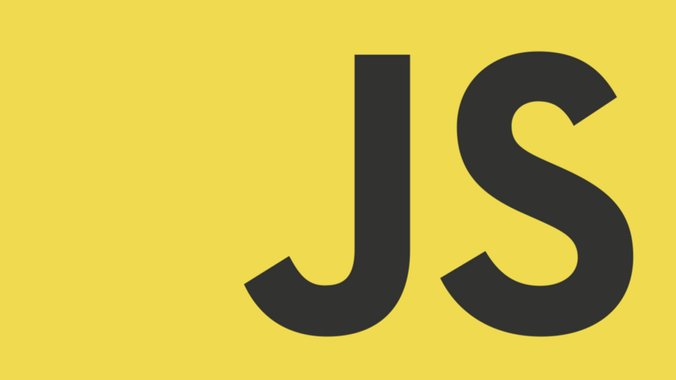
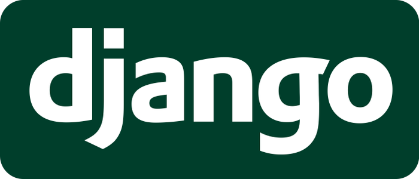
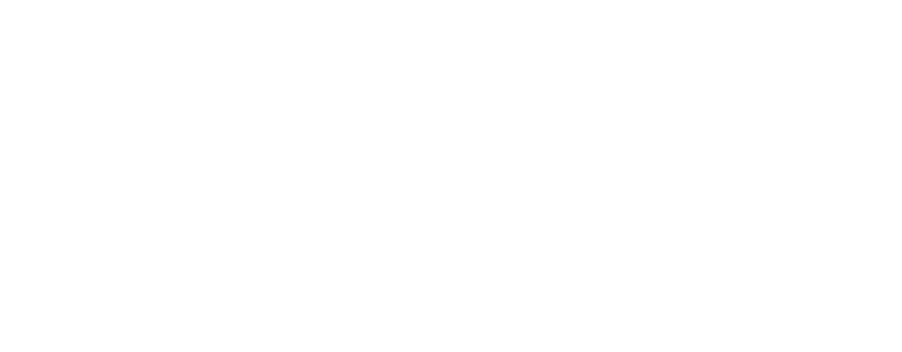

<!-- This readme was created by Samuel RIGAUD - https://github.com/s-rigaud -->

# Hi, I'm Sam 👋

### A full stack developer and student living in France 🍀

### Personal details:

👓 I’m currently working for **[Lengow](https://www.lengow.com/en)** as a Django developer in the e-commerce industry

📚 I am also studying to get my **MIAGE master degree**

🗣️ I’m currently learning **Swedish** !

🏐 **Ball** and **music** are life

📫 How to reach me: DM on [LinkedIn](https://www.linkedin.com/in/samuel-rigaud/) or PR on my projects

### GitHub activity:

  

<!-- Weird hack to add extra line sparator -->

⠀

  
  
  
  
  
  
  
  
  
  
  

### Last major projects

  
  
  

  <a href="https://github.com/s-rigaud/s-rigaud/blob/main/PROJECTS.MD">My best projects are detailed here 🏆</a>

